# DeAcademy — Process Flows (v3.9, terakhir diperbarui 2026-09-16)

Alur proses kunci untuk implementasi backend. Diagram dalam mermaid — render di GitHub/VS Code/artifact viewer. Referensi silang: `PRD.md`, `DATA-MODEL.md`, `API-ENDPOINTS.md`.

---

## 1. Signup dengan Position Dropdown

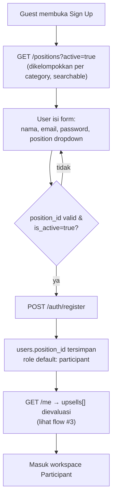

Tanpa opsi "Other/free text". Kalau posisi user tidak ada di daftar → user memilih yang terdekat; penambahan posisi baru adalah wewenang Operator/Super Admin (flow #2).

---

## 2. Kelola Master Data Posisi (Operator / Super Admin)

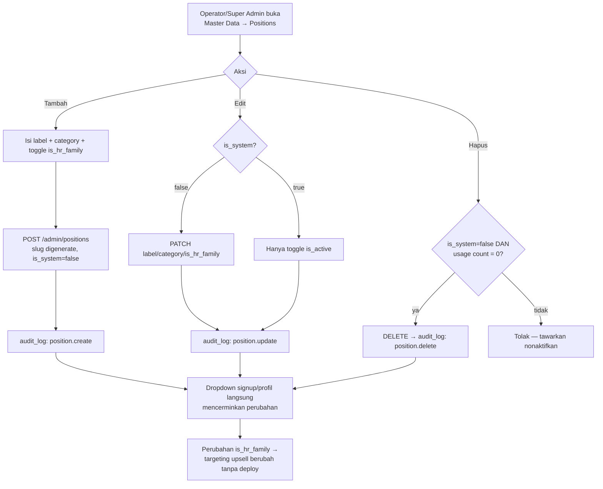

---

## 3. Evaluasi Upsell saat Login / Refresh Profil

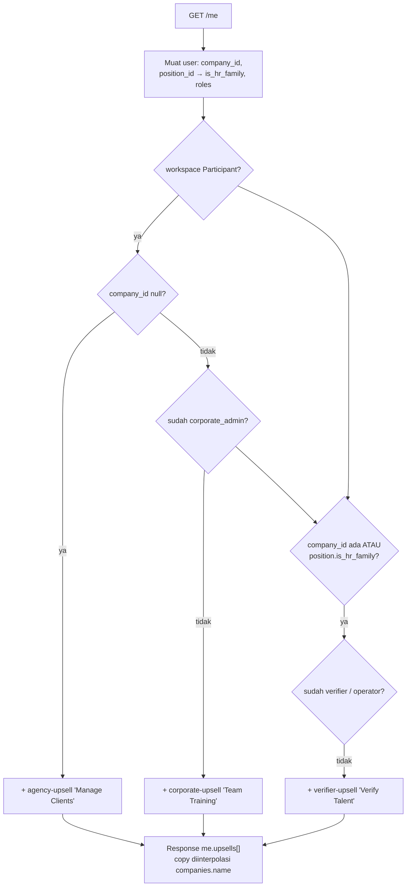

Aturan lengkap + edge case (12 kombinasi teruji): `tests/upsell_rules.py` dan `tests/test_upsell_matrix.py`. Keputusan kunci: **individu HR tanpa perusahaan mendapat agency + verifier sekaligus**.

---

## 4. Alur Belajar: Enroll → Course Player → Selesai Training

**v3.4:** flow ini berhenti di training selesai — exam bukan lagi item course player.
Lanjutannya ada di §10 (training-path masuk modul Exam terpisah).

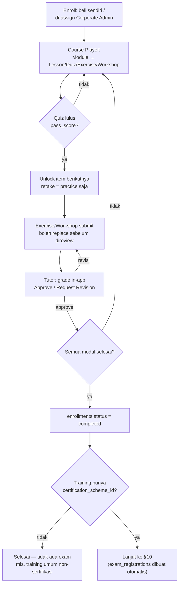

---

## 5. Verifikasi Talent (Consent-Gated)

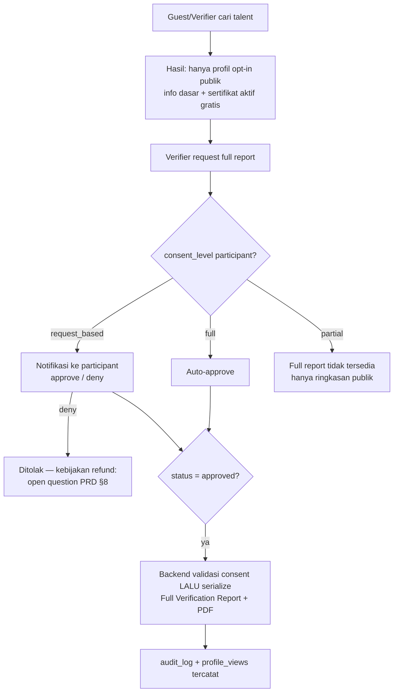

---

## 6. Lifecycle Sertifikat

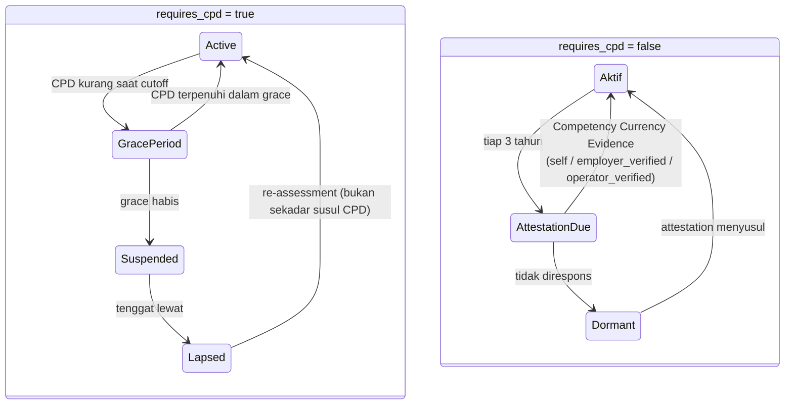

---

## 7. Verifikasi Sertifikat (Nomor / QR / Bulk) — v3.1

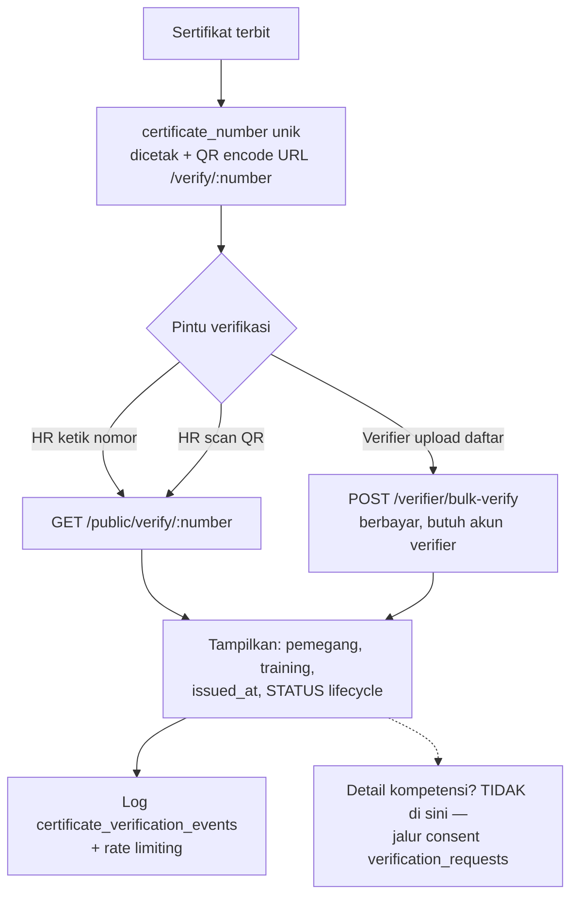

## 8. Demand Engine — Skill Gap ke Katalog — v3.1

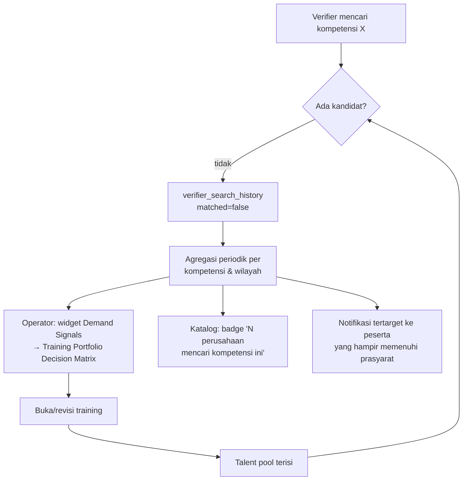

## 9. Alumni Offboarding — Portfolio Milik Individu — v3.1

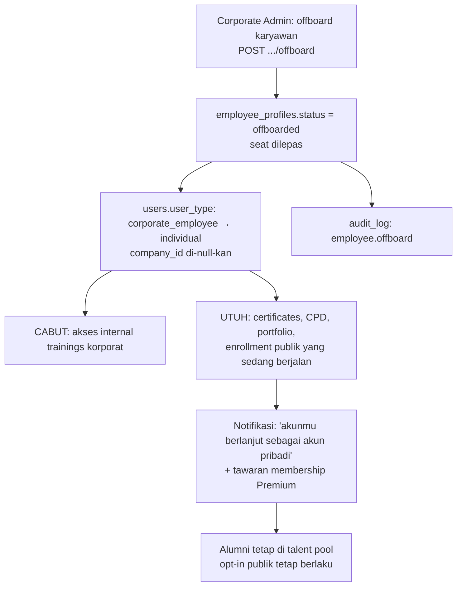

## 10. Exam — Training-Path — v3.4

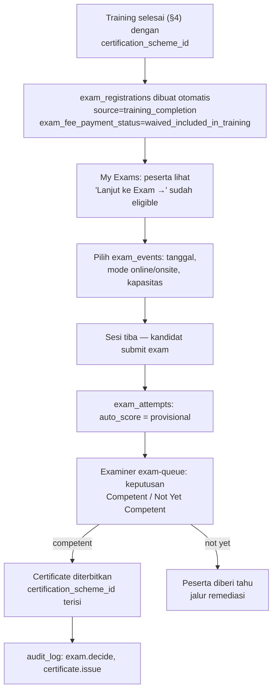

## 11. Exam — Direct-Path (Tanpa Training) — v3.4

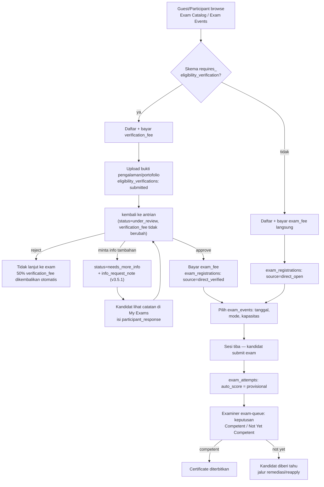

## 12. Bulk Assign Training per Department (v3.5)

```mermaid
flowchart TD
    A[Corporate Admin buka Assign Training<br/>pilih training dari katalog] --> B[Filter department, mis. HSE]
    B --> C{Training punya<br/>recurrence_months?}
    C -- tidak --> D["Select All in {Department}<br/>pilih semua karyawan di department"]
    C -- ya --> E["Server hitung per karyawan:<br/>enrollments.completed_at + recurrence_months &gt; today?"]
    E -- "ya (belum jatuh tempo)" --> F["Not Due Until {tanggal}<br/>dikecualikan dari bulk-select"]
    E -- "tidak (jatuh tempo / belum pernah)" --> D
    F -.-> G[Tetap bisa ditambah manual<br/>oleh Corporate Admin]
    D --> H[Ganti filter ke department lain<br/>+ Select All lagi]
    H --> I["Seleksi digabung (union)<br/>bukan replace — regresi dari bug lama"]
    I --> J[Submit → POST .../assign-training<br/>department atau employee_ids[]]
    G --> J
    J --> K[enrollments dibuat + notifikasi<br/>response sertakan skipped_count]
```

Menjawab dua kasus dari review lampiran: (1) assign ke department 50 orang tanpa
klik satu-satu, (2) karyawan yang sudah training tahun ini untuk training
recurring tidak otomatis ke-assign ulang, tapi tetap bisa ditambah manual kalau
memang disengaja.

> **Node J ("enrollments dibuat") kini benar-benar diimplementasikan di
> prototipe (v3.9, 2026-09-16)**: sebelumnya diagram ini menggambarkan
> perilaku yang DIDOKUMENTASIKAN tapi tidak pernah dikodekan — klik "Assign
> Training" di kode hanya menampilkan banner sukses lokal, tanpa menulis
> apa pun. Diperbaiki dengan state client-side `assignedTrainings` (pola
> sama seperti `schemes`), ditulis oleh Assign Training, dibaca balik oleh
> participant "My Trainings" — training yang di-assign muncul **digabung**
> dengan training lain milik karyawan tsb, bukan section/tab terpisah,
> sesuai desain `enrollments` yang satu tabel untuk semua sumber
> (`DATA-MODEL.md` §4). Karena data karyawan (`Lr`) di prototipe ini murni
> contoh tanpa korespondensi ke akun login sungguhan (kecuali satu: Ratna
> Wijayanti, Corporate Admin yang juga persona Participant), hanya
> assignment ke beliau yang bisa diverifikasi end-to-end lewat login nyata.

## 13. Access Request — Upsell ke Approval (v3.5)

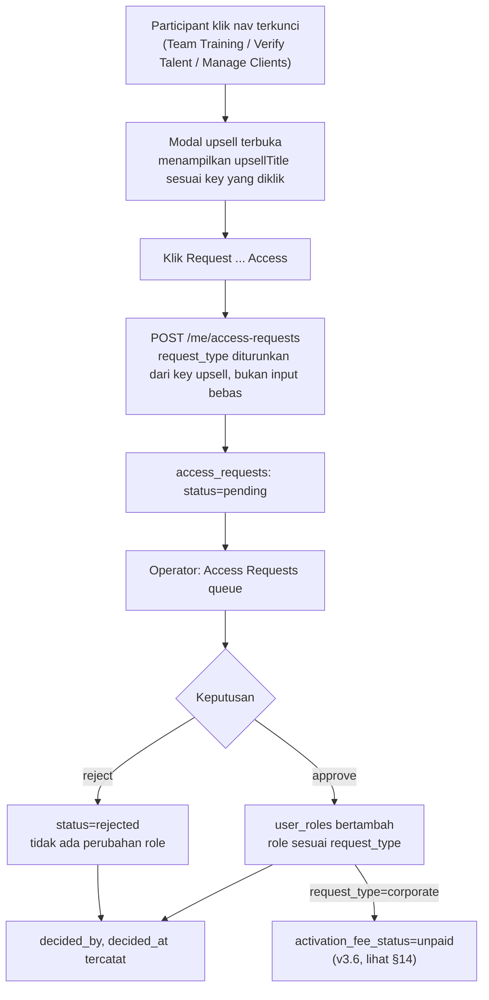

Sebelum v3.5, langkah D-J ini tidak ada sama sekali — klik "Request ... Access"
hanya mengubah state lokal di modal (hilang saat modal ditutup), sehingga tidak
ada persona yang bisa melihat atau menindaklanjuti permintaan tsb. Kepemilikan
queue ada di Operator, bukan Management — lihat `ROLES-PERMISSIONS-MATRIX.md`
Prinsip 13.

## 14. Payment Gates — Verifier Full Access & Corporate Activation (v3.6)

User menguji flow §13 lalu bertanya langsung: approve saja tidak menyelesaikan
kebutuhan bisnis — dua akses ini butuh pembayaran, terpisah dari consent
kandidat (untuk Verifier) dan terpisah dari pembelian training (untuk
Corporate).

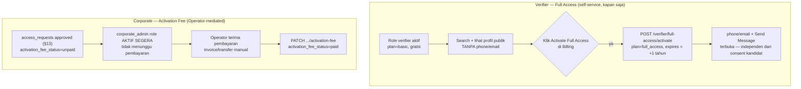

Keputusan eksplisit user (bukan asumsi): (1) model tahunan unlimited untuk
Verifier, bukan pay-per-request atau campuran; (2) approve dan bayar adalah dua
langkah terpisah untuk keduanya — role/akses aktif duluan, pembayaran menyusul,
supaya alur approval Operator tetap cepat. Lihat `DATA-MODEL.md` §6, §9c.

## 15. Content Authoring — Siapa Mengarang Apa (v3.7)

Ditulis untuk menjawab langsung pertanyaan "siapa yang upload materi, buat quiz,
buat exam" — dan menutup gap yang ditemukan saat mengeceknya ke prototype.

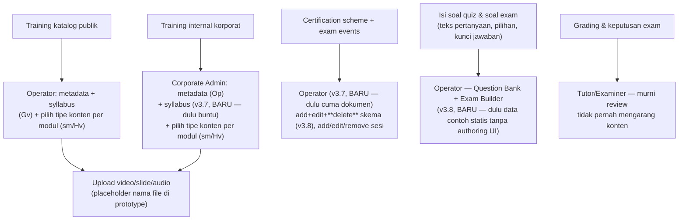

`Tutor`/`Examiner` sengaja tidak muncul di jalur otoring manapun kecuali node K —
perannya adalah menilai hasil kerja peserta (Exercise/Workshop/Exam/Eligibility
Verification), bukan membuat materi. Detail alur node I ada di §16.

---

## 16. Question Bank + Exam Authoring + Stable-ID Migration (Phase 1, v3.8)

Ditulis setelah user meminta lanjutan langsung dari temuan §15 (soal quiz/exam
masih data contoh statis). Dokumen kontrak korektif eksternal yang sempat
diupload sengaja **tidak dipakai literal** — beberapa tuntutannya (autorisasi
server, audit trail persisten) tidak bisa ada di prototipe client-side-only
ini; scope Phase 1 dikalibrasi sendiri ke kapasitas prototipe, sisanya
didokumentasikan sebagai Phase 2 (lihat `DATA-MODEL.md` §3b).

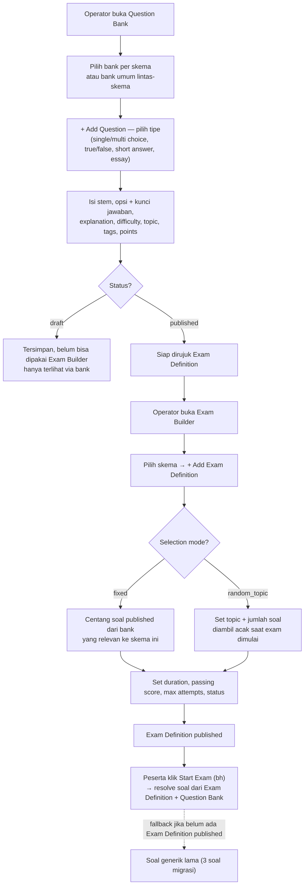

**Migrasi Stable-ID yang menyertainya** (prasyarat sebelum delete skema bisa
didukung dengan aman — lihat Prinsip 15/16 di `ROLES-PERMISSIONS-MATRIX.md`):

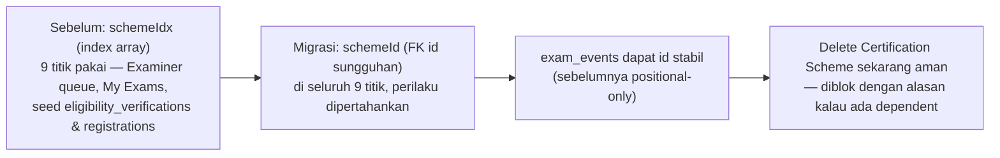

**Yang sengaja belum dibangun (Phase 2, didokumentasikan bukan diimplementasikan)**:
review/approval workflow terpisah (Draft→Review→Approved→Published→Retired
dengan aktor berbeda), question versioning immutable + attempt snapshot,
tipe soal matching/ordering, bulk import/export, exam blueprint (section-based
composition), manual-scoring queue tersendiri untuk essay/short-answer, dan
analytics performa soal. Lihat `DATA-MODEL.md` §3b untuk daftar lengkap.
